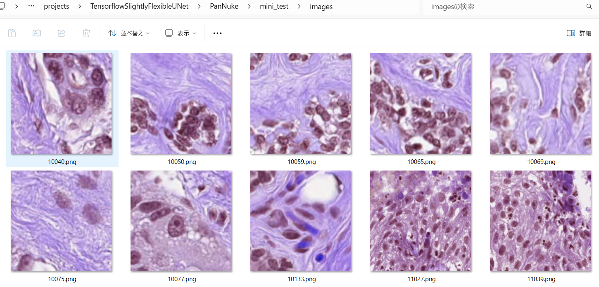

<h2>Tensorflow-Image-Segmentation-PanNuke (2024/04/27)</h2>

This is an experimental Image Segmentation project for PanNuke based on
the <a href="https://github.com/sarah-antillia/Tensorflow-Image-Segmentation-API">Tensorflow-Image-Segmentation-API</a>, and
<a href="https://drive.google.com/file/d/13kfwR1u2GeTC-Y9kFAhMdrq0WaDeHL5H/view?usp=sharing">PanNuke-ImageMask-Dataset-V2.zip</a>

 
On the PanNuke dataset, please refer to <a href="https://github.com/sarah-antillia/ImageMask-Dataset-PanNuke">ImageMask-Dataset-PanNuke</a>. 

 
Segmentation samples 
<table>
<tr>
<th>Input:image</th>
<th>Mask(ground_truth)</th>
<th>Prediction:inferred_mask</th>
</tr>
<tr>
<td></td>
<td></td>
<td></td>

</table>

 
 
We have already tried a specific category <a href="https://github.com/sarah-antillia/Image-Segmentation-Neoplastic-Cell">Image-Segmentation-Neoplastic-Cell</a> of the PanNuke Image Segmentation. 
 

At this experiment, we tried Image-Segmentation of the whole categories of PanNuke Dataset by using a tool 
<a href="./src/RGB2GrayscaleImageMaskDataset.py">RGB2GrayscaleImageMaskDataset.py</a> to convert RGB masks to a single channel Grayscale masks. 
On the detail of the tool, please refer to <a href="https://github.com/sarah-antillia/RGBMask-To-GrayscaleMask-Conversion-Tool">RGBMask-To-GrayscaleMask-Conversion-Tool</a>.
 
 
We used the simple UNet Model 
<a href="./src/TensorflowUNet.py">TensorflowSlightlyFlexibleUNet</a> for this PanNuke Segmentation. 
As shown in <a href="https://github.com/sarah-antillia/Tensorflow-Image-Segmentation-API">Tensorflow-Image-Segmentation-API</a>.
you may try other Tensorflow UNet Models: 

<li><a href="./src/TensorflowSwinUNet.py">TensorflowSwinUNet.py</a></li>
<li><a href="./src/TensorflowMultiResUNet.py">TensorflowMultiResUNet.py</a></li>
<li><a href="./src/TensorflowAttentionUNet.py">TensorflowAttentionUNet.py</a></li>
<li><a href="./src/TensorflowEfficientUNet.py">TensorflowEfficientUNet.py</a></li>
<li><a href="./src/TensorflowUNet3Plus.py">TensorflowUNet3Plus.py</a></li>
<li><a href="./src/TensorflowDeepLabV3Plus.py">TensorflowDeepLabV3Plus.py</a></li>
 

<h3>1. Dataset Citatiion</h3>
The image dataset used here has been taken from the following kaggle web site. 

<pre>
Cancer Instance Segmentation and Classification 1
https://www.kaggle.com/datasets/andrewmvd/cancer-inst-segmentation-and-classification
About this Dataset
This dataset, also known as PanNuke, contains semi automatically generated nuclei instance segmentation and 
classification images with exhaustive nuclei labels across 19 different tissue types. The dataset consists 
of 481 visual fields, of which 312 are randomly sampled from more than 20K whole slide images at different 
magnifications, from multiple data sources.
In total the dataset contains 205,343 labeled nuclei, each with an instance segmentation mask. Models trained 
on PanNuke can aid in whole slide image tissue type segmentation, and generalize to new tissues.
More Medical Imaging Datasets
Part 1 (current)
Part 2
Part 3
More datasets
Acknowledgements
If you use this dataset in your research, please credit the authors:

Original Publications
@article{gamper2020pannuke,
title={PanNuke Dataset Extension, Insights and Baselines},
author={Gamper, Jevgenij and Koohbanani, Navid Alemi and Graham, Simon and Jahanifar, Mostafa and Benet,
Ksenija and Khurram, Syed Ali and Azam, Ayesha and Hewitt, Katherine and Rajpoot, Nasir},
journal={arXiv preprint arXiv:2003.10778},
year={2020}
}

@inproceedings{gamper2019pannuke,
title={Pannuke: An open pan-cancer histology dataset for nuclei instance segmentation and classification},
author={Gamper, Jevgenij and Koohbanani, Navid Alemi and Benet, Ksenija and Khuram, Ali and Rajpoot, Nasir},
booktitle={European Congress on Digital Pathology},
pages={11--19},
year={2019},
organization={Springer}
}

Hovernet formated files were provided by chandlertimm with the available code here.

License
CC BY NC SA 4.0

Splash Image
Image by Otis Brawley released as public domain by National Cancer Institute, available here
</pre>

 

<h3>
<a id="2">
2 PanNuke ImageMask Dataset
</a>
</h3>
 If you would like to train this PanNuke Segmentation model by yourself,
please download the ImageMask-Dataset-PanNuke-V2 created by us from the google drive
<a href="https://drive.google.com/file/d/13kfwR1u2GeTC-Y9kFAhMdrq0WaDeHL5H/view?usp=sharing">PanNuke-ImageMask-Dataset-V2.zip</a>
 
 
Please expand the downloaded ImageMaskDataset and place them under <b>./dataset</b> folder to be

<pre>
./dataset
└─./PanNuke
     ├─test
     │  ├─images
     │  └─masks
     ├─train
     │  ├─images
     │  └─masks
     └─valid
         ├─images
         └─masks
</pre>

<b>PanNuke Dataset statistics</b> 
 

As shown above, the number of images of train and valid dataset is not necessarily large.
 

<h3>
<a id="3">
3 TensorflowSlightlyFlexibleUNet
</a>
</h3>
This <a href="./src/TensorflowUNet.py">TensorflowUNet</a> model is slightly flexibly customizable by a configuration file. 
For example, <b>TensorflowSlightlyFlexibleUNet/PanNuke</b> model can be customizable
by using <a href="./projects/TensorflowSlightlyFlexibleUNet/PanNuke/train_eval_infer.config">train_eval_infer.config</a>

<h3>
3.1 Training
</h3>
Please move to a <b>./projects/TensorflowSlightlyFlexibleUNet/PanNuke</b> folder, 
and run the following bat file to train TensorflowUNet model for PanNuke. 
<pre>
./1.train.bat
</pre>
, which simply runs <a href="./src/TensorflowUNetGeneratorTrainer.py">TensorflowUNetTrainer.py </a>
in the following way.

<pre>
python ../../../src/TensorflowUNetTrainer.py ./train_eval_infer.config
</pre>
Train console output: 
 
Train metrics: 
 
Train losses: 
 
 

<h3>
3.2 Evaluation
</h3>
Please move to a <b>./projects/TensorflowSlightlyFlexibleUNet/PanNuke</b> folder, 
and run the following bat file to evaluate TensorflowUNet model for PanNuke. 
<pre>
./2.evaluate.bat
</pre>
<pre>
python ../../../src/TensorflowUNetEvaluator.py ./train_eval_infer_aug.config
</pre>
Evaluation console output: 

  
<a href="./projects/TensorflowSlightlyFlexibleUNet/PanNuke/evaluation.csv">evaluation.csv</a>
As shown below, the loss (bce_dice_loss) is not so low.
<pre>
loss,0.3136
binary_accuracy,0.935
</pre>

<h2>
3.3 Inference
</h2>
Please move to a <b>./projects/TensorflowSlightlyFlexibleUNet/PanNuke</b> folder 
,and run the following bat file to infer segmentation regions for images by the Trained-TensorflowUNet model for PanNuke. 
<pre>
./3.infer.bat
</pre>
<pre>
python ../../../src/TensorflowUNetInferencer.py ./train_eval_infer_aug.config
</pre>

Sample test images 
 
Sample test mask (ground_truth) 
 

 
Inferred test masks 
 
 
Merged test images and inferred masks  
  

Enlarged samples 
<table>
<tr>
<td>
mini_test/images/10050.png 

</td>
<td>
Inferred merged/10050.png 

</td> 
</tr>

<tr>
<td>
mini_test/images/10059.png 

</td>
<td>
Inferred merged/149096927-149096943-002.jpg 

</td> 
</tr>

<tr>
<td>
mini_test/images/10069.png 

</td>
<td>
Inferred merged/10069.png 

</td> 
</tr>

<tr>
<td>
mini_test/images/10133.png 

</td>
<td>
Inferred merged/10133.png 

</td> 
</tr>

<!-- 5-->
<tr>
<td>
mini_test/images/11027.png 

</td>
<td>
Inferred merged/11027.png 

</td> 
</tr>

</table>

<h3>
References
</h3>
<b>1. PanNuke: An Open Pan-Cancer Histology Dataset for Nuclei Instance Segmentation and Classification</b> 
Gamper, Jevgenij and Koohbanani, Navid Alemi and Benet, Ksenija and Khuram, Ali and Rajpoot, Nasir 
<pre>
https://academictorrents.com/details/99f2c7b57b95500711e33f2ee4d14c9fd7c7366c
</pre>
 
<b>2. Cancer Instance Segmentation and Classification 1</b> 
<pre>
https://www.kaggle.com/datasets/andrewmvd/cancer-inst-segmentation-and-classification
</pre>
 
<b>3. ImageMask-Dataset-PanNuke</b> 
Toshiyuki Arai @antillia.com 
<pre>
https://github.com/sarah-antillia/ImageMask-Dataset-PanNuke
</pre>

<b>4. Image-Segmentation-Neoplastic-Cell</b> 
Toshiyuki Arai @antillia.com 
https://github.com/sarah-antillia/Image-Segmentation-Neoplastic-Cell

